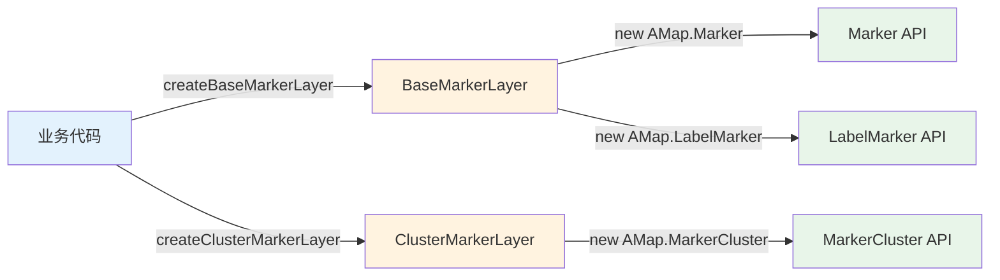

# MapUtils 分层架构设计

## 架构概览

```
┌─────────────────────────────────────────────────────────────┐
│                     🎯 业务应用层                            │
│  ┌─────────────┐  ┌─────────────────┐  ┌─────────────────┐  │
│  │  图层管理    │  │  AMap实例方法   │  │  AMap静态工具   │  │
│  │  创建/销毁   │  │  setFitView等   │  │  坐标转换等     │  │
│  └─────────────┘  └─────────────────┘  └─────────────────┘  │
└─────────────────────────────────────────────────────────────┘
                              ↓
┌─────────────────────────────────────────────────────────────┐
│                   ⚙️ 图层管理服务层                           │
│  ┌─────────────────────┐    ┌─────────────────────────────┐ │
│  │  ClusterMarkerLayer │    │      BaseMarkerLayer        │ │
│  │    海量点图层管理      │    │      基础标记图层管理        │ │
│  │                     │    │                             │ │
│  │  管理: ClusterMarker │    │  管理: Marker、LabelMarker  │ │
│  └─────────────────────┘    └─────────────────────────────┘ │
└─────────────────────────────────────────────────────────────┘
                              ↓
┌─────────────────────────────────────────────────────────────┐
│                     🔧 原生API层                             │
│  ┌───────────────┐  ┌───────────────┐  ┌─────────────────┐  │
│  │ LabelMarker   │  │    Marker     │  │  MarkerCluster  │  │
│  │    Layer      │  │    Layer      │  │     Layer       │  │
│  │               │  │               │  │                 │  │
│  │ 高德LabelMarker│  │  高德Marker   │  │  高德点聚合API  │  │
│  │   原生API     │  │   原生API     │  │                 │  │
│  └───────────────┘  └───────────────┘  └─────────────────┘  │
└─────────────────────────────────────────────────────────────┘
```

---

## 分层详解

### 1. 🎯 业务应用层

面向业务开发者的统一接口层，屏蔽底层复杂度。

| 功能模块 | 能力说明 | 典型方法 |
|---------|---------|---------|
| **图层管理** | 图层的创建、显示、隐藏、销毁 | `createBaseMarkerLayer()`, `showLayer()`, `destroy()` |
| **AMap实例方法** | 地图实例的常用操作 | `setFitView()`, `setZoom()`, `setCenter()` |
| **AMap静态工具** | 不依赖实例的工具函数 | `lngLatToPixel()`, `calculateDistance()` |

---

### 2. ⚙️ 图层管理服务层

图层的核心管理实现，负责图层生命周期和状态维护。

```
┌─────────────────────────────────────────────────────────┐
│                    LayerManager                         │
│                      (图层管理器)                        │
├─────────────────────────┬───────────────────────────────┤
│    ClusterMarkerLayer   │       BaseMarkerLayer         │
│      (海量点图层)        │       (基础标记图层)           │
│                         │                               │
│  ┌─────────────────┐   │   ┌─────────────────────────┐  │
│  │  管理对象         │   │   │       管理对象          │  │
│  │  ├─ ClusterMarker │   │   │  ├─ Marker             │  │
│  │  └─ ...          │   │   │  └─ LabelMarker        │  │
│  └─────────────────┘   │   └─────────────────────────┘  │
│                         │                               │
│  特性: 点聚合、海量渲染   │   特性: 单点标记、带标签标记    │
└─────────────────────────┴───────────────────────────────┘
```

| 图层类型 | 管理对象 | 适用场景 |
|---------|---------|---------|
| **ClusterMarkerLayer** | `ClusterMarker` | 海量点数据、需要聚合显示 |
| **BaseMarkerLayer** | `Marker`、`LabelMarker` | 普通标记点、带文字标签的标记 |

---

### 3. 🔧 原生API层

对接高德地图底层 API，实现具体的渲染能力。

| 模块 | 对接API | 职责 |
|-----|--------|------|
| **LabelMarker Layer** | `AMap.LabelMarker` | 高性能文字标注 |
| **Marker Layer** | `AMap.Marker` | 标准标记点 |
| **ClusterMarker Layer** | `AMap.MarkerCluster` | 点聚合效果 |

---

## 调用链路



---

## 分层价值

| 层级 | 核心价值 |
|-----|---------|
| 业务应用层 | **简化调用** - 一行代码创建复杂图层 |
| 图层管理服务层 | **逻辑复用** - 统一管理图层生命周期 |
| 原生API层 | **能力对接** - 封装底层差异，随时可替换厂商 |
